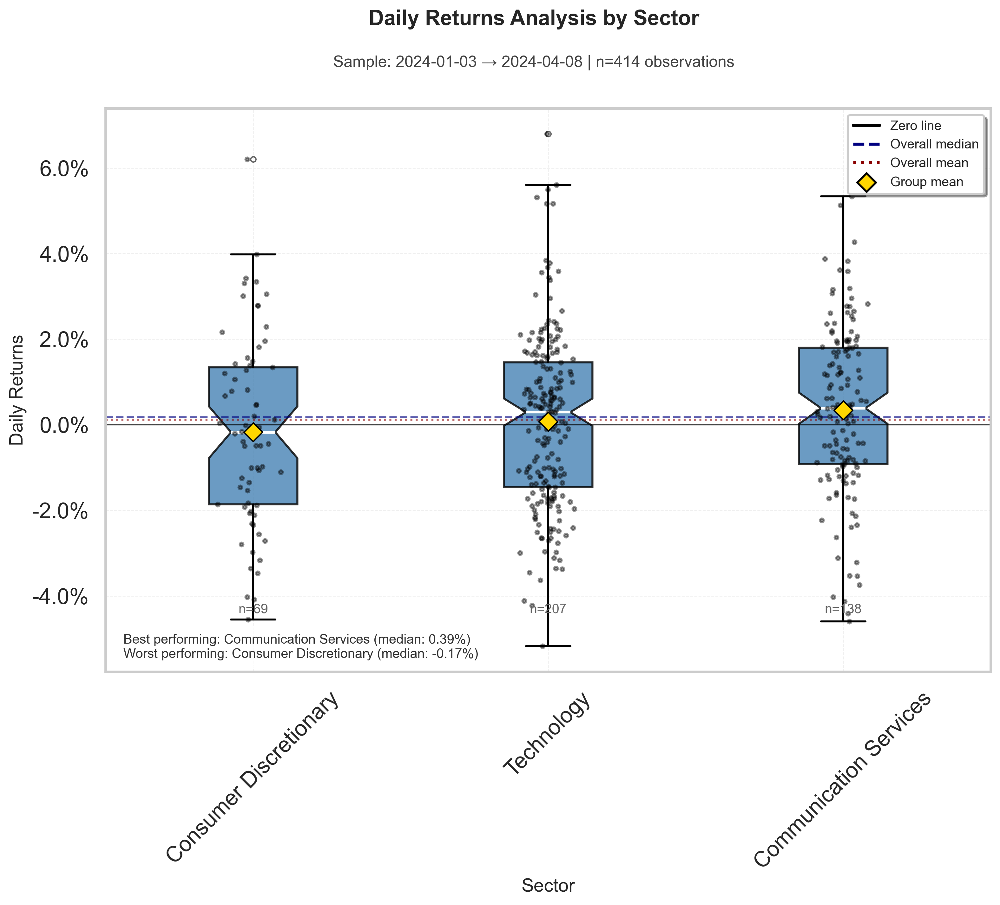
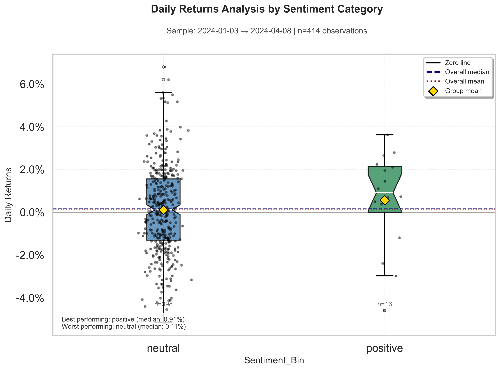
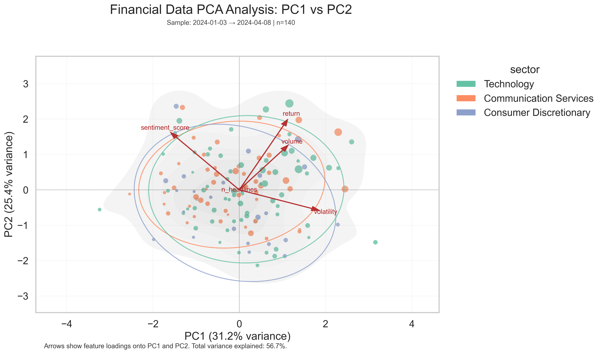

## Executive Summary

### Context

I analyzed a short, recent market window for a small basket of tickers, combining daily prices/activity with company headline sentiment. When live APIs are unavailable, the workflow uses a realistic synthetic sample so everything still runs end‑to‑end even if API data is not available.

### Methods

- **Quantitative**: Descriptives; one‑way ANOVA across sectors; OLS with HC3 robust SEs (`return ~ sentiment_score + volume + volatility + C(sector)`); and PCA for a 2D “big picture" overview.
- **Qualitative**: Term frequencies and lightweight topics on headlines (kept small for readability).
- **Mixed‑methods**: I pair the numbers with what the news was “about” to make the stats easier to interpret.

### Results

- **ANOVA (sectors)**: F ≈ 1.563, p ≈ 0.211. Translation: sector averages weren’t credibly different in this short sample.
- **OLS (with HC3)**: Sentiment’s coefficient ≈ 0.00438 with p ≈ 0.83; model R² ≈ 0.033. In this window, sentiment didn’t add explanatory power once volume, volatility, and sector were in the mix.
- **PCA (structure snapshot)**: PC1 ≈ 31.2% and PC2 ≈ 25.4% of variance (≈ 56.7% total). PC1 leaned on volatility/sentiment/volume; PC2 leaned on return/sentiment/volume. So a two‑axis view captures a decent chunk without a ton of compression.

### Figures

What to look for: spread/medians across sectors. Here, boxes overlap a lot—consistent with the non‑significant ANOVA.

Quick read on whether “good vs bad news” days line up with returns. In the sample the distributions overlap; no strong separation.

The 2D map shows overall structure. Arrows indicate which features push along each axis; clusters or gradients hint at common regimes.

### How to put this to any use

Not much here of useful statistical significance but it's a good starting point for further analysis. It's more of a demo than a useful tool for trading. However, with a bigger sample window and more tickers, topics, and sectors, it could be a starting point for a useful analysis.

### Limitations

- Very small sample window
- Headline sentiment is dictionary‑based
- Small number of tickers, topics, sectors, and headlines
- Sector labels are broad
- Synthetic data is not real market data (obviously)
- Etc...

### Next steps

- Extend the window and re‑check ANOVA/OLS; add market factors (e.g., index returns) as controls.
- Try richer text, few more topics, and try a more sophisticated sentiment analysis method.
- Hold out a period to confirm whether patterns persist out‑of‑sample.

### Appendix: key numbers pulled from the analysis notebooks

- ANOVA F=1.56297 (p=0.21075)
- OLS: coef(sentiment)=0.00438; p=0.83010; R²=0.03285
- PCA: PC1 var=31.23%, PC2 var=25.43% (total ≈ 56.66%)
